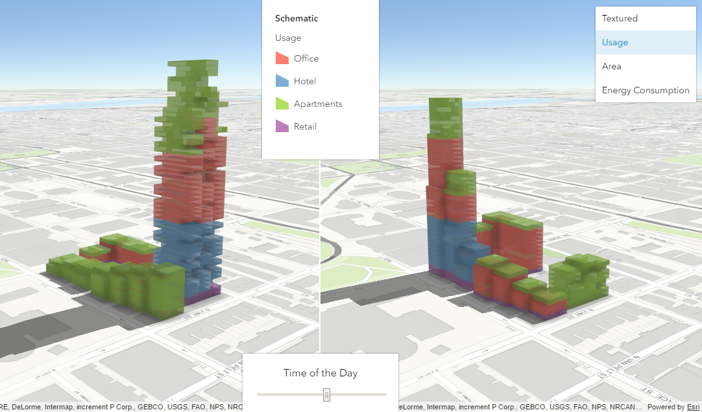
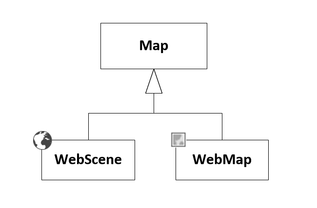
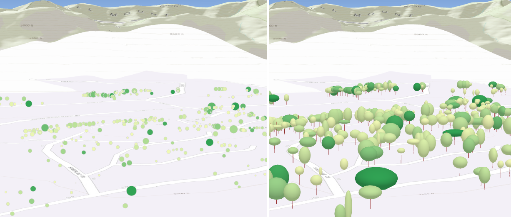
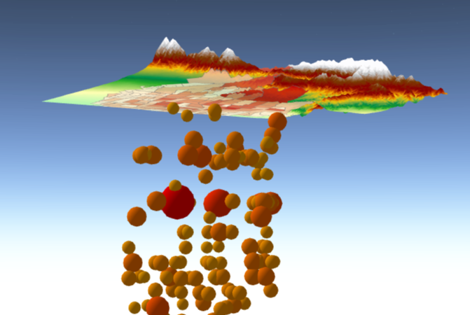

<!-- .slide: data-background="images/Picture1.png" -->

<div style="padding-top: 300px"/>

# Building 3D GIS applications for the browser using JavaScript

<br>

Janett Baresel and Pascal Mueller

ESRI R&amp;D Center Zürich

---

<!-- .slide: data-background="images/Picture2.jpg" -->

## Table of contents
1. Urban planning application
1. API basics
1. Attribute-driven visualizations
1. Widgets
1. Create a split view
1. More API

---

<!-- .slide: data-background="images/Picture2.jpg" -->

## Urban planning application



---

<!-- .slide: data-background="images/Picture2.jpg" -->

## API basics

Create a new scene

<div class="twos">
  <div class="snippet">
  <pre><code class="lang-js hljs javascript">

  var map = new Map({
     basemap: "satellite",
     ground: "world-elevation"
   });


  var view = new SceneView({
     container: "viewDiv",
     map: map,
     scale: 100000000,
     center: [-101.17, 21.78]
  });</code>
   </pre>
  <!--<svg data-play-frame="frame-auto-cast" class="play-code" viewBox="0 0 24 24"><path fill="#999" d="M12,20.14C7.59,20.14 4,16.55 4,12.14C4,7.73 7.59,4.14 12,4.14C16.41,4.14 20,7.73 20,12.14C20,16.55 16.41,20.14 12,20.14M12,2.14A10,10 0 0,0 2,12.14A10,10 0 0,0 12,22.14A10,10 0 0,0 22,12.14C22,6.61 17.5,2.14 12,2.14M10,16.64L16,12.14L10,7.64V16.64Z" /></svg>-->
  </div>
  <div class="snippet-preview">
    <iframe id="frame-auto-cast" data-src="./snippets/basics1.html"></iframe>
  </div>
</div>

---

<!-- .slide: data-background="images/Picture2.jpg" -->

## API basics

The WebScene


---

<!-- .slide: data-background="images/Picture2.jpg" -->

## API basics

Open a scene

<div class="twos">
  <div class="snippet">
  <pre><code class="lang-js hljs javascript">
  var webscene = new WebScene({
    portalItem: {
      id: "33a2a791a22b4cf1b23858f463363bfe"
    }
  });

  var view = new SceneView({
     container: "viewDiv",
     map: webscene
  });</code>
   </pre>
  <!--<svg data-play-frame="frame-auto-cast" class="play-code" viewBox="0 0 24 24"><path fill="#999" d="M12,20.14C7.59,20.14 4,16.55 4,12.14C4,7.73 7.59,4.14 12,4.14C16.41,4.14 20,7.73 20,12.14C20,16.55 16.41,20.14 12,20.14M12,2.14A10,10 0 0,0 2,12.14A10,10 0 0,0 12,22.14A10,10 0 0,0 22,12.14C22,6.61 17.5,2.14 12,2.14M10,16.64L16,12.14L10,7.64V16.64Z" /></svg>-->
  </div>
  <div class="snippet-preview">
    <iframe id="frame-auto-cast" data-src="./snippets/basics2.html"></iframe>
  </div>
</div>

---

<!-- .slide: data-background="images/Picture2.jpg" -->


## API basics

Add a layer

<div class="twos">
  <div class="snippet">
  <pre><code class="lang-js hljs javascript">
  var layer = Layer.fromPortalItem({
         portalItem: {
           id: "39dd4914f9274f70a34b9a7e54b7ad60"
         }
       }).then(function(layer){
         webscene.add(layer);
     });</code>
   </pre>
  <!--<svg data-play-frame="frame-auto-cast" class="play-code" viewBox="0 0 24 24"><path fill="#999" d="M12,20.14C7.59,20.14 4,16.55 4,12.14C4,7.73 7.59,4.14 12,4.14C16.41,4.14 20,7.73 20,12.14C20,16.55 16.41,20.14 12,20.14M12,2.14A10,10 0 0,0 2,12.14A10,10 0 0,0 12,22.14A10,10 0 0,0 22,12.14C22,6.61 17.5,2.14 12,2.14M10,16.64L16,12.14L10,7.64V16.64Z" /></svg>-->
  </div>
  <div class="snippet-preview">
    <iframe id="frame-auto-cast" data-src="./snippets/basics3.html"></iframe>
  </div>
</div>

---

<!-- .slide: data-background="images/Picture2.jpg" -->

## Attribute-driven visualization

- **Renderers define how to visually represent each feature in a Layer.**




---

<!-- .slide: data-background="images/Picture2.jpg" -->

## Attribute-driven visualization
- **UniqueValueRenderer** allows you to symbolize features in a FeatureLayer and SceneLayer based on one or more matching string attributes.


---

<!-- .slide: data-background="images/Picture2.jpg" -->

## Attribute-driven visualization

Unique strings with the UniqueValueRenderer

<div class="twos">
  <div class="snippet">
  <pre><code class="lang-js hljs javascript">
   var usageRenderer = new UniqueValueRenderer({
      field: "Usage",
      uniqueValueInfos: [
        {
          value: "Office",
          symbol: new MeshSymbol3D({
            symbolLayers: [new FillSymbol3DLayer({
              material: {color: "#fd7f6f"}
            })]
          })
        },
        {
          value: "Hotel",
          symbol: new MeshSymbol3D({
            symbolLayers: [new FillSymbol3DLayer({
              material: {color: "#7eb0d5"}
            })]
          })
        },
        ...
      ]
      });
   layer.renderer = usageRenderer;</code>
   </pre>
  <!--<svg data-play-frame="frame-auto-cast" class="play-code" viewBox="0 0 24 24"><path fill="#999" d="M12,20.14C7.59,20.14 4,16.55 4,12.14C4,7.73 7.59,4.14 12,4.14C16.41,4.14 20,7.73 20,12.14C20,16.55 16.41,20.14 12,20.14M12,2.14A10,10 0 0,0 2,12.14A10,10 0 0,0 12,22.14A10,10 0 0,0 22,12.14C22,6.61 17.5,2.14 12,2.14M10,16.64L16,12.14L10,7.64V16.64Z" /></svg>-->
  </div>
  <div class="snippet-preview">
    <iframe id="frame-auto-cast" data-src="./snippets/uniquevaluerenderer.html"></iframe>
  </div>
</div>

---

<!-- .slide: data-background="images/Picture2.jpg" -->

## Attribute-driven visualization

A range of values with the SimpleRenderer and VisualVariables


---

<!-- .slide: data-background="images/Picture2.jpg" -->

## Attribute-driven visualization

<div class="twos">
  <div class="snippet">
  <pre><code class="lang-js hljs javascript">
    var energyRenderer = new SimpleRenderer({
       symbol: new MeshSymbol3D({
         symbolLayers: [new FillSymbol3DLayer({
           material: {color: "#b8e4f8"}
         })]
       }),
       visualVariables: [{
         type: "color",
         field: "Energy (MWh/yr)",
         stops: [
           {
             value: 1
             color: "#43a94d",
           },
           {
             value: 100,
             color: "#fbfdbb"
           },
           {
             value: 200,
             color: "#db2a24"
           }]
       }]
     });
   layer.renderer = energyRenderer;</code>
   </pre>
  <!--<svg data-play-frame="frame-auto-cast" class="play-code" viewBox="0 0 24 24"><path fill="#999" d="M12,20.14C7.59,20.14 4,16.55 4,12.14C4,7.73 7.59,4.14 12,4.14C16.41,4.14 20,7.73 20,12.14C20,16.55 16.41,20.14 12,20.14M12,2.14A10,10 0 0,0 2,12.14A10,10 0 0,0 12,22.14A10,10 0 0,0 22,12.14C22,6.61 17.5,2.14 12,2.14M10,16.64L16,12.14L10,7.64V16.64Z" /></svg>-->
  </div>
  <div class="snippet-preview">
    <iframe id="frame-auto-cast" data-src="./snippets/simplerenderer.html"></iframe>
  </div>
</div>

---

<!-- .slide: data-background="images/Picture2.jpg" -->

## Legend Widget*

<div class="twos">
  <div class="snippet">
  <pre><code class="lang-js hljs javascript">
    var legend = new Legend({
      view: view
    });

    view.ui.add(legend, "bottom-right");</code>
   </pre>
  <!--<svg data-play-frame="frame-auto-cast" class="play-code" viewBox="0 0 24 24"><path fill="#999" d="M12,20.14C7.59,20.14 4,16.55 4,12.14C4,7.73 7.59,4.14 12,4.14C16.41,4.14 20,7.73 20,12.14C20,16.55 16.41,20.14 12,20.14M12,2.14A10,10 0 0,0 2,12.14A10,10 0 0,0 12,22.14A10,10 0 0,0 22,12.14C22,6.61 17.5,2.14 12,2.14M10,16.64L16,12.14L10,7.64V16.64Z" /></svg>-->
  </div>
  <div class="snippet-preview">
    <iframe id="frame-auto-cast" data-src="./snippets/legend.html"></iframe>
  </div>
</div>

\* JS API 4.1 will support legends for scene layers and many more.

---

<!-- .slide: data-background="images/Picture2.jpg" -->

## Popups

<div class="twos">
  <div class="snippet">
  <pre><code class="lang-js hljs javascript">
     layer.popupTemplate = new PopupTemplate({
      title: layer.title,
      content: "{*}",
      fieldInfos: layer.fields && layer.fields.map(function (field) {
        return {
          fieldName: field.name,
          label: field.alias,
          visible: true
        };
      })
    });
    </code>
   </pre>
  <!--<svg data-play-frame="frame-auto-cast" class="play-code" viewBox="0 0 24 24"><path fill="#999" d="M12,20.14C7.59,20.14 4,16.55 4,12.14C4,7.73 7.59,4.14 12,4.14C16.41,4.14 20,7.73 20,12.14C20,16.55 16.41,20.14 12,20.14M12,2.14A10,10 0 0,0 2,12.14A10,10 0 0,0 12,22.14A10,10 0 0,0 22,12.14C22,6.61 17.5,2.14 12,2.14M10,16.64L16,12.14L10,7.64V16.64Z" /></svg>-->
  </div>
  <div class="snippet-preview">
    <iframe id="frame-auto-cast" data-src="./snippets/popup.html"></iframe>
  </div>
</div>


---


<!-- .slide: data-background="images/Picture2.jpg" -->

## Time Slider

<div class="twos">
  <div class="snippet">
  <pre><code class="lang-js hljs javascript">
    view.environment.lighting.directShadowsEnabled = true;
    view.environment.lighting.ambientOcclusionEnabled = true;

    function timeSliderChanged(value){
      var hours = calculateHoursFromValue(value);
      var minutes = calculateMinutesFromValue(value);
      var newDate = new Date(view.environment.lighting.date.getTime());
      newDate.setUTCHours(hours);
      newDate.setUTCMinutes(minutes);
      view.environment.lighting.date = newDate;
    }

    <input type="range" oninput="timeSliderChanged(value)">
    </code>
   </pre>
  <!--<svg data-play-frame="frame-auto-cast" class="play-code" viewBox="0 0 24 24"><path fill="#999" d="M12,20.14C7.59,20.14 4,16.55 4,12.14C4,7.73 7.59,4.14 12,4.14C16.41,4.14 20,7.73 20,12.14C20,16.55 16.41,20.14 12,20.14M12,2.14A10,10 0 0,0 2,12.14A10,10 0 0,0 12,22.14A10,10 0 0,0 22,12.14C22,6.61 17.5,2.14 12,2.14M10,16.64L16,12.14L10,7.64V16.64Z" /></svg>-->
  </div>
  <div class="snippet-preview">
    <iframe id="frame-auto-cast" data-src="./snippets/timeslider.html"></iframe>
  </div>
</div>


---

<!-- .slide: data-background="images/Picture2.jpg" -->

## Split View

- 2 views with synchronized cameras
- be aware of the performance implications

```
var view1 = new SceneView({
  container: "view1Div",
  map: webScene
});

var view2 = new SceneView({
  container: "view2Div",
  map: webScene
});
```


---

<!-- .slide: data-background="images/Picture2.jpg" -->

## Split View

- synchronization of the camera

```
all([view1, view2]).then(function() {
  view1.watch("camera", function(camera) {
    if (view1.interacting || view1.animation) {
      view2.camera = camera;
    }
  });
  view2.watch("camera", function(camera) {
    if (view2.interacting || view2.animation) {
      view1.camera = camera;
    }
  });
});

view1.on('layerview-create', function(evt) {
  if (evt.layer === theLayerToNotShowHere) {
    evt.layerView.visible = false;
  }
});
```


---

<!-- .slide: data-background="images/Picture2.jpg" -->

## More API: Presentation

- slide contains: viewpoint, layer visibility, basemap, environment + metadata

```
webscene.presentation = {
  slides : []
}

// capture current scene state
var slide = Slide.createFrom(view);

// re-apply the stored state
slide.applyTo(view);

```


---


<!-- .slide: data-background="images/Picture2.jpg" -->

## More API: Camera

```
new Camera({
    position: new Point({
      x: -116.54, // longitude
      y: 33.83, // latitude
      z: 1000, // altitude in meters
      spatialReference: SpatialReference.WGS84
    }),
    heading: 30, // 0 .. 360°, clockwise
    tilt: 45 // 0..180°, 0° straight down
  })

```


---

<!-- .slide: data-background="images/Picture2.jpg" -->

## More API: Animation
```
view.goTo(target, options);
```
- Target can be
  - [longitude, latitude] pair of coordinates
  - Geometry (or array of Geometry[])
  - Graphic (or array of Graphic[])
  - Viewpoint
  - Camera


---


<!-- .slide: data-background="images/Picture2.jpg" -->

## More API: Global - local
<table  class="reveal">
    <tr>
      <td>Global</td>
      <td>Local</td>
    </tr>
    <tr>
      <td>geographic, global extent, spherical</td>
      <td>projected, local extent, planar</td>
    </tr>

    <tr>
      <td></td>
      <td></td>
    </tr>
  </table>

---

<!-- .slide: data-background="images/Picture2.jpg" -->

## More API: Global - local
```
scene = new WebScene({
  viewingMode: 'local',
});
```

```
scene = new WebScene({
  viewingMode: 'global',
});
```
---

<!-- .slide: data-background="images/Picture2.jpg" -->

## More API: Clipping

- clipping is only supported for local scenes
```
scene = new WebScene({
    viewingMode: 'local',
    clippingArea: {
      xmin: 344556.17949990794,
      ymin: 3786680.957522931,
      xmax: 368905.9689491527,
      ymax: 3801033.594521225,
      spatialReference: { wkid: 26711 }
    },
    clippingEnabled: true
});
```
---

<!-- .slide: data-background="images/Picture2.jpg" -->
## More API: External Rendering
<table  class="reveal">
    <tr>
      <td></td>
      <td><a href="http://developers.arcgis.com/javascript/latest/sample-code/scene-external-renderer/live/index.html"></a></td>
    </tr>
  </table>


---


<!-- .slide: data-background="images/Picture6.jpg" -->


