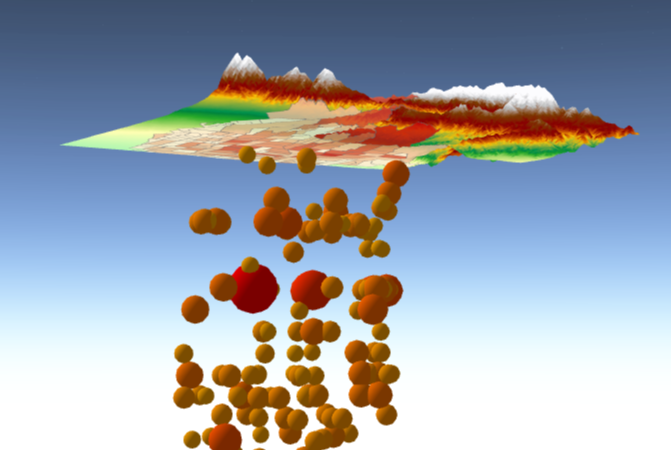

<!-- .slide: data-background="images/Picture1.png" -->

<div style="padding-top: 100px"/>


<!-- .slide: data-background="images/Picture1.png" -->

#  Building 3D GIS Applications with JavaScript

<br>

Javier Gutierrez and Janett Baresel

ESRI R&amp;D Center Zürich

---

<!-- .slide: data-background="images/Picture2.png" -->

## Table of contents
1. Introduction
1. 4.x Javascript API
1. Building an App: New York
1. Building an App: Lyon
1. Outro
1. Questions

---

<!-- .slide: data-background="images/Picture2.png" -->

## Introduction

talk about the platform (pro, online, apps)

---

<!-- .slide: data-background="images/Picture2.png" -->

## 4.x Javascript API

- from 3.x to 4.x
- programming patterns

---

<!-- .slide: data-background="images/Picture2.png" -->

## Building an App: New York

[need an image of the final app here]

---

<!-- .slide: data-background="images/Picture2.png" -->

## Creating a SceneView


<div class="twos">
  <div class="snippet">
  <pre><code class="lang-js hljs javascript">
 var map = new Map({
   basemap: "satellite",
   ground: "world-elevation"
 });


 var view = new SceneView({
   container: "viewDiv",
   map: map,
   center: [-101.17, 21.78]
 });</code>
   </pre>
  <!--<svg data-play-frame="frame-auto-cast" class="play-code" viewBox="0 0 24 24"><path fill="#999" d="M12,20.14C7.59,20.14 4,16.55 4,12.14C4,7.73 7.59,4.14 12,4.14C16.41,4.14 20,7.73 20,12.14C20,16.55 16.41,20.14 12,20.14M12,2.14A10,10 0 0,0 2,12.14A10,10 0 0,0 12,22.14A10,10 0 0,0 22,12.14C22,6.61 17.5,2.14 12,2.14M10,16.64L16,12.14L10,7.64V16.64Z" /></svg>-->
  </div>
  <div class="snippet-preview">
    <iframe id="frame-auto-cast" data-src="./snippets/01-basics.html"></iframe>
  </div>
</div>

---

<!-- .slide: data-background="images/Picture2.png" -->

## Adding Layers

[something general about adding layers in the API and what kind of layers we support]

---


<!-- .slide: data-background="images/Picture2.png" -->

## Adding Layers

Adding 2 different layers to a scene


<div class="twos">
  <div class="snippet">
  <pre><code class="lang-js hljs javascript">


 var pcLayer = new PointCloudLayer({
   url: myUrl
 });

 var sceneLayer = new SceneLayer({
   portalItem: {
     id: "2e0761b9a4274b8db52c4bf34356911e"
   }
 });

 map.add(sceneLayer);
 map.add(pcLayer);


       </code>
   </pre>
  <!--<svg data-play-frame="frame-auto-cast" class="play-code" viewBox="0 0 24 24"><path fill="#999" d="M12,20.14C7.59,20.14 4,16.55 4,12.14C4,7.73 7.59,4.14 12,4.14C16.41,4.14 20,7.73 20,12.14C20,16.55 16.41,20.14 12,20.14M12,2.14A10,10 0 0,0 2,12.14A10,10 0 0,0 12,22.14A10,10 0 0,0 22,12.14C22,6.61 17.5,2.14 12,2.14M10,16.64L16,12.14L10,7.64V16.64Z" /></svg>-->
  </div>
  <div class="snippet-preview">
    <iframe id="frame-auto-cast" data-src="./snippets/02-basics.html"></iframe>
  </div>
</div>

http://tiles.arcgis.com/tiles/z2tnIkrLQ2BRzr6P/arcgis/rest/services/USGSNYC_2014_LiDAR/SceneServer


---

<!-- .slide: data-background="images/Picture2.png" -->


## Adding widgets

[adding the layer widget here]

<div class="twos">
  <div class="snippet">
  <pre><code class="lang-js hljs javascript">
  view.then(function() {
    var layerList = new LayerList({
      view: view
    });

    view.ui.add(layerList, "top-right");
  });
         </code>
   </pre>
  <!--<svg data-play-frame="frame-auto-cast" class="play-code" viewBox="0 0 24 24"><path fill="#999" d="M12,20.14C7.59,20.14 4,16.55 4,12.14C4,7.73 7.59,4.14 12,4.14C16.41,4.14 20,7.73 20,12.14C20,16.55 16.41,20.14 12,20.14M12,2.14A10,10 0 0,0 2,12.14A10,10 0 0,0 12,22.14A10,10 0 0,0 22,12.14C22,6.61 17.5,2.14 12,2.14M10,16.64L16,12.14L10,7.64V16.64Z" /></svg>-->
  </div>
  <div class="snippet-preview">
    <iframe id="frame-auto-cast" data-src="./snippets/03-widget.html"></iframe>
  </div>
</div>

---

<!-- .slide: data-background="images/Picture2.png" -->

## Layer Symbology

[assign smart mapping renderer to buildings]


---

<!-- .slide: data-background="images/Picture2.png" -->

## Layer Symbology

[assign different PCL renderer]

---

<!-- .slide: data-background="images/Picture2.png" -->

## Query Elevation
[hitTest and query elevation]

<div class="twos">
  <div class="snippet">
  <pre><code class="lang-js hljs javascript">
  view.on("click", function(screenPoint) {

     view.hitTest(screenPoint)
        .then(function(hit) {
          if (hit.results.length === 0) return;

          hitPoint = hit.results[0].mapPoint;
          return map.ground.queryElevation(hitPoint);
        })
        .then(function(elevationResult) {
          if (!elevationResult) return;

          var groundPoint = elevationResult.geometry;
          var distance = hitPoint.z - groundPoint.z;

          var graphics = createGraphics(hitPoint,
            groundPoint, distance);

          view.graphics.addMany(graphics);
        });
     });
  }
  </code>
   </pre>
  <!--<svg data-play-frame="frame-auto-cast" class="play-code" viewBox="0 0 24 24"><path fill="#999" d="M12,20.14C7.59,20.14 4,16.55 4,12.14C4,7.73 7.59,4.14 12,4.14C16.41,4.14 20,7.73 20,12.14C20,16.55 16.41,20.14 12,20.14M12,2.14A10,10 0 0,0 2,12.14A10,10 0 0,0 12,22.14A10,10 0 0,0 22,12.14C22,6.61 17.5,2.14 12,2.14M10,16.64L16,12.14L10,7.64V16.64Z" /></svg>-->
  </div>
  <div class="snippet-preview">
    <iframe id="frame-auto-cast" data-src="./snippets/06-hitTest.html"></iframe>
  </div>
</div>
---

<!-- .slide: data-background="images/Picture2.png" -->

## Building an App: Lyon
[image of the final scene]

---

<!-- .slide: data-background="images/Picture2.png" -->

## Declutter

[app with toggle to show declutter off/on]

---

<!-- .slide: data-background="images/Picture2.png" -->

## Improve Perspective

[app with toggle to show improve perspective off/on]

---

<!-- .slide: data-background="images/Picture2.png" -->

## Callout Lines

[app with toggle to turn callout lines off/on]

---

<!-- .slide: data-background="images/Picture2.png" -->

## 3D Models

[showing how to add realistic models to a scene]

---

<!-- .slide: data-background="images/Picture2.png" -->

## Webscene loading

[loading a webscene with exactly the same config]

---


<!-- .slide: data-background="images/Picture2.png" -->

## Popups and webscene saving

[changing a popup and saving a scene]
[link to load the webscene in SV]

---

<!-- .slide: data-background="images/Picture2.png" -->

## More API: Presentation

- slide contains: viewpoint, layer visibility, basemap, environment + metadata

```
webscene.presentation = {
  slides : []
}

// capture current scene state
var slide = Slide.createFrom(view);

// re-apply the stored state
slide.applyTo(view);

```

---

<!-- .slide: data-background="images/Picture2.png" -->

## More API: Global - local
<table  class="reveal">
    <tr>
      <td>Global</td>
      <td>Local</td>
    </tr>
    <tr>
      <td>geographic, global extent, spherical</td>
      <td>projected, local extent, planar</td>
    </tr>

    <tr>
      <td></td>
      <td></td>
    </tr>
  </table>

---

<!-- .slide: data-background="images/Picture2.png" -->

## More API: Global - local
```
scene = new WebScene({
  viewingMode: 'local',
});
```

```
scene = new WebScene({
  viewingMode: 'global',
});
```
---

<!-- .slide: data-background="images/Picture2.png" -->

## More API: Clipping

- clipping is only supported for local scenes
```
scene = new WebScene({
    viewingMode: 'local',
    clippingArea: {
      xmin: 344556.17949990794,
      ymin: 3786680.957522931,
      xmax: 368905.9689491527,
      ymax: 3801033.594521225,
      spatialReference: { wkid: 26711 }
    },
    clippingEnabled: true
});
```
---

<!-- .slide: data-background="images/Picture2.png" -->
## More API: External Rendering
<table  class="reveal">
    <tr>
      <td></td>
      <td><a href="http://developers.arcgis.com/javascript/latest/sample-code/scene-external-renderer/live/index.html"></a></td>
    </tr>
  </table>


