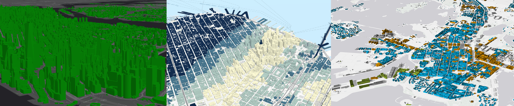

<!-- .slide: data-background="images/Picture1.png" -->

<!-- .slide: data-background="images/Picture1.png" -->

#  Building 3D GIS Applications with JavaScript

 

Javier Gutierrez and Janett Baresel

ESRI R&amp;D Center Zürich

---

<!-- .slide: data-background="images/Picture2.png" -->

## Building an App: New York

---

<!-- .slide: data-background="images/Picture2.png" -->

## Creating a SceneView

  

  <pre><code class="lang-js hljs javascript">
 var map = new Map({
   basemap: "dark-gray",
   ground: "world-elevation"
 });

 var view = new SceneView({
   container: "viewDiv",
   map: map,
   center: [-101.17, 21.78]
 });</code>
   </pre>
  <!--<svg data-play-frame="frame-auto-cast" class="play-code" viewBox="0 0 24 24"><path fill="#999" d="M12,20.14C7.59,20.14 4,16.55 4,12.14C4,7.73 7.59,4.14 12,4.14C16.41,4.14 20,7.73 20,12.14C20,16.55 16.41,20.14 12,20.14M12,2.14A10,10 0 0,0 2,12.14A10,10 0 0,0 12,22.14A10,10 0 0,0 22,12.14C22,6.61 17.5,2.14 12,2.14M10,16.64L16,12.14L10,7.64V16.64Z" /></svg>-->
  

  

    <iframe id="frame-auto-cast" data-src="./snippets/ny/01-basics.html"></iframe>
  

---

<!-- .slide: data-background="images/Picture2.png" -->

## Layers

**Supported in 2D and 3D**

| | |
| - | - |
| FeatureLayer | https://developers.arcgis.com/javascript/latest/api-reference/esri-layers-FeatureLayer.html |
| GraphicsLayer | https://developers.arcgis.com/javascript/latest/api-reference/esri-layers-GraphicsLayer.html |
| MapImageLayer | https://developers.arcgis.com/javascript/latest/api-reference/esri-layers-MapImageLayer.html |
| ImageryLayer | https://developers.arcgis.com/javascript/latest/api-reference/esri-layers-ImageryLayer.html |
| TileLayer | https://developers.arcgis.com/javascript/latest/api-reference/esri-layers-TileLayer.html |
| VectorTileLayer | https://developers.arcgis.com/javascript/latest/api-reference/esri-layers-VectorTileLayer.html |

<small >More layers coming soon</small>

---

<!-- .slide: data-background="images/Picture2.png" -->

## Layers

**Supported in 3D only**

| | |
| - | - |
| SceneLayer | https://developers.arcgis.com/javascript/latest/api-reference/esri-layers-SceneLayer.html |
| ElevationLayer | https://developers.arcgis.com/javascript/latest/api-reference/esri-layers-ElevationLayer.html |
| IntegratedMeshLayer | https://developers.arcgis.com/javascript/latest/api-reference/esri-layers-IntegratedMeshLayer.html |
| PointCloudLayer | https://developers.arcgis.com/javascript/latest/api-reference/esri-layers-PointCloudLayer.html |

---

<!-- .slide: data-background="images/Picture2.png" -->

## Adding Layers

Layers can be added via the service url or the portal id

  

  <pre><code class="lang-js hljs javascript">

 var pcLayer = new PointCloudLayer({
   url: "https://..."
 });

 var sceneLayer = new SceneLayer({
   portalItem: {
     id: "2e0761b9a4274b8db52c4bf34356911e"
   }
 });

 map.add(sceneLayer);
 map.add(pcLayer);

       </code>
   </pre>
  <!--<svg data-play-frame="frame-auto-cast" class="play-code" viewBox="0 0 24 24"><path fill="#999" d="M12,20.14C7.59,20.14 4,16.55 4,12.14C4,7.73 7.59,4.14 12,4.14C16.41,4.14 20,7.73 20,12.14C20,16.55 16.41,20.14 12,20.14M12,2.14A10,10 0 0,0 2,12.14A10,10 0 0,0 12,22.14A10,10 0 0,0 22,12.14C22,6.61 17.5,2.14 12,2.14M10,16.64L16,12.14L10,7.64V16.64Z" /></svg>-->
  

  

    <iframe id="frame-auto-cast" data-src="./snippets/ny/02-basics.html"></iframe>
  

---

<!-- .slide: data-background="images/Picture2.png" -->

## API widgets

- a number of ready-to-use widgets 
- modular and easily added and positioned in the view 
- separation of logic and view 
- easy custom styling via themes and custom css 
- guide to create custom widgets 

---

<!-- .slide: data-background="images/Picture2.png" -->

## Adding a widget

Adding the layer list widget to toggle layer visbilities

  

  <pre><code class="lang-js hljs javascript">

  view.then(function() {
    var layerList = new LayerList({
      view: view
    });

    view.ui.add(layerList, "top-right");
  });
         </code>
   </pre>
  <!--<svg data-play-frame="frame-auto-cast" class="play-code" viewBox="0 0 24 24"><path fill="#999" d="M12,20.14C7.59,20.14 4,16.55 4,12.14C4,7.73 7.59,4.14 12,4.14C16.41,4.14 20,7.73 20,12.14C20,16.55 16.41,20.14 12,20.14M12,2.14A10,10 0 0,0 2,12.14A10,10 0 0,0 12,22.14A10,10 0 0,0 22,12.14C22,6.61 17.5,2.14 12,2.14M10,16.64L16,12.14L10,7.64V16.64Z" /></svg>-->
  

  

    <iframe id="frame-auto-cast" data-src="./snippets/ny/03-widget.html"></iframe>
  

---

<!-- .slide: data-background="images/Picture2.png" -->

## Adding a group layer

  

  <pre><code class="lang-js hljs javascript">

    var groupLayer = new GroupLayer({
      title: "NY Layers",
      visibilityMode: "exclusive"
    });

    groupLayer.addMany([pcLayer, sceneLayer]);
    map.add(groupLayer);

       </code>
   </pre>
  <!--<svg data-play-frame="frame-auto-cast" class="play-code" viewBox="0 0 24 24"><path fill="#999" d="M12,20.14C7.59,20.14 4,16.55 4,12.14C4,7.73 7.59,4.14 12,4.14C16.41,4.14 20,7.73 20,12.14C20,16.55 16.41,20.14 12,20.14M12,2.14A10,10 0 0,0 2,12.14A10,10 0 0,0 12,22.14A10,10 0 0,0 22,12.14C22,6.61 17.5,2.14 12,2.14M10,16.64L16,12.14L10,7.64V16.64Z" /></svg>-->
  

  

    <iframe id="frame-auto-cast" data-src="./snippets/ny/02a-basics.html"></iframe>
  

---

<!-- .slide: data-background="images/Picture2.png" -->

## Changing the time of day

environment allows changing shadows and the time of day

  

  <pre><code class="lang-js hljs javascript">
 view.environment = {
   lighting: {
     directShadowsEnabled: true,
     date:
       new Date("Sun Mar 15 2015 09:00:00 GMT/-0400 (EDT)")
   }
 };
         </code>
   </pre>
  <!--<svg data-play-frame="frame-auto-cast" class="play-code" viewBox="0 0 24 24"><path fill="#999" d="M12,20.14C7.59,20.14 4,16.55 4,12.14C4,7.73 7.59,4.14 12,4.14C16.41,4.14 20,7.73 20,12.14C20,16.55 16.41,20.14 12,20.14M12,2.14A10,10 0 0,0 2,12.14A10,10 0 0,0 12,22.14A10,10 0 0,0 22,12.14C22,6.61 17.5,2.14 12,2.14M10,16.64L16,12.14L10,7.64V16.64Z" /></svg>-->
  

  

    <iframe id="frame-auto-cast" data-src="./snippets/ny/03a-time.html"></iframe>
  

---

<!-- .slide: data-background="images/Picture2.png" -->

## Layer Symbology

- layers have renderers to define how they are visualized
- renderers: SimpleRenderer, ClassBreaksRenderer, UniqueValueRenderer

---

<!-- .slide: data-background="images/Picture2.png" -->

## Layer Symbology

Visual variables: define parameters for data-driven visualizations of numeric data

---

<!-- .slide: data-background="images/Picture2.png" -->

## Layer Symbology

Create a SimpleRenderer, coloring all buildings the same

  

  <pre><code class="lang-js hljs javascript">
   sceneLayer.renderer = new SimpleRenderer({
     symbol: new MeshSymbol3D({
       symbolLayers:
        new Collection([
         new FillSymbol3DLayer({
           material: { color: "green" }
         })
       ])
     })
   });
         </code>
   </pre>
  <!--<svg data-play-frame="frame-auto-cast" class="play-code" viewBox="0 0 24 24"><path fill="#999" d="M12,20.14C7.59,20.14 4,16.55 4,12.14C4,7.73 7.59,4.14 12,4.14C16.41,4.14 20,7.73 20,12.14C20,16.55 16.41,20.14 12,20.14M12,2.14A10,10 0 0,0 2,12.14A10,10 0 0,0 12,22.14A10,10 0 0,0 22,12.14C22,6.61 17.5,2.14 12,2.14M10,16.64L16,12.14L10,7.64V16.64Z" /></svg>-->
  

  

    <iframe id="frame-auto-cast" data-src="./snippets/ny/04-smartmapping.html"></iframe>
  

---

<!-- .slide: data-background="images/Picture2.png" -->

## Layer Symbology

Create a SimpleRenderer, using visual variables

  

  <pre><code class="lang-js hljs javascript">
   sceneLayer.renderer = new SimpleRenderer({
     symbol: new MeshSymbol3D({
       symbolLayers: new Collection([new FillSymbol3DLayer()]),
        visualVariables: [{
         type: "color",
         field: "CNSTRCT_YR",
         stops: [
           {
             color: [58,128,89,1],
             value: 1912,
             label: "< 1912"
           },
           {
             color: [155,191,133,1],
             value: 1925
           },
           ...
         ]
       }]
     })
   });
         </code>
   </pre>
  <!--<svg data-play-frame="frame-auto-cast" class="play-code" viewBox="0 0 24 24"><path fill="#999" d="M12,20.14C7.59,20.14 4,16.55 4,12.14C4,7.73 7.59,4.14 12,4.14C16.41,4.14 20,7.73 20,12.14C20,16.55 16.41,20.14 12,20.14M12,2.14A10,10 0 0,0 2,12.14A10,10 0 0,0 12,22.14A10,10 0 0,0 22,12.14C22,6.61 17.5,2.14 12,2.14M10,16.64L16,12.14L10,7.64V16.64Z" /></svg>-->
  

  

    <iframe id="frame-auto-cast" data-src="./snippets/ny/04a-smartmapping.html"></iframe>
  

---

<!-- .slide: data-background="images/Picture2.png" -->

## Layer Symbology

Create a PointCloudStretchRenderer for point cloud layer for the elevation attribute

  

  <pre><code class="lang-js hljs javascript">
   var newRenderer = new PointCloudStretchRenderer({
     field: "ELEVATION",
     stops: [{
       value: -1,
       color: [61, 51, 158]
     }, {
       value: 1,
       color: [73, 196, 196]
     }, {
       value: 5,
       color: [104, 196, 73]
     },
     ...
     ]
   });

   pcLayer.renderer = newRenderer;
         </code>
   </pre>
  <!--<svg data-play-frame="frame-auto-cast" class="play-code" viewBox="0 0 24 24"><path fill="#999" d="M12,20.14C7.59,20.14 4,16.55 4,12.14C4,7.73 7.59,4.14 12,4.14C16.41,4.14 20,7.73 20,12.14C20,16.55 16.41,20.14 12,20.14M12,2.14A10,10 0 0,0 2,12.14A10,10 0 0,0 12,22.14A10,10 0 0,0 22,12.14C22,6.61 17.5,2.14 12,2.14M10,16.64L16,12.14L10,7.64V16.64Z" /></svg>-->
  

  

    <iframe id="frame-auto-cast" data-src="./snippets/ny/05-pcl.html"></iframe>
  

---

<!-- .slide: data-background="images/Picture2.png" -->

## hitTest & query elevation

- hitTest searches for graphics that intersect the specified screen coordinates
- ground can be queried for elevation at a given point

---

<!-- .slide: data-background="images/Picture2.png" -->

## Query Elevation
determine point in 3D scene from screen point

  

  <pre><code class="lang-js hljs javascript">
  view.on("click", function(screenPoint) {

     view.hitTest(screenPoint)
        .then(function(hit) {
          if (hit.results.length === 0) return;

          hitPoint = hit.results[0].mapPoint;
        });
     });
  }
  </code>
   </pre>
  <!--<svg data-play-frame="frame-auto-cast" class="play-code" viewBox="0 0 24 24"><path fill="#999" d="M12,20.14C7.59,20.14 4,16.55 4,12.14C4,7.73 7.59,4.14 12,4.14C16.41,4.14 20,7.73 20,12.14C20,16.55 16.41,20.14 12,20.14M12,2.14A10,10 0 0,0 2,12.14A10,10 0 0,0 12,22.14A10,10 0 0,0 22,12.14C22,6.61 17.5,2.14 12,2.14M10,16.64L16,12.14L10,7.64V16.64Z" /></svg>-->
  

  

    <iframe id="frame-auto-cast" data-src="./snippets/ny/06-hitTest.html"></iframe>
  

---

<!-- .slide: data-background="images/Picture2.png" -->

## Query Elevation
query elevation for point in 3D scene

  

  <pre><code class="lang-js hljs javascript">
  view.on("click", function(screenPoint) {

     view.hitTest(screenPoint)
        .then(function(hit) {
          if (hit.results.length === 0) return;

          hitPoint = hit.results[0].mapPoint;
          return view.map.ground.queryElevation(hitPoint);
        })
        .then(function(elevationResult) {
          if (!elevationResult) return;

          var groundPoint = elevationResult.geometry;
          var distance = hitPoint.z - groundPoint.z;

          var graphics = createGraphics(hitPoint,
            groundPoint, distance);

          view.graphics.addMany(graphics);
        });
     });
  }
  </code>
   </pre>
  <!--<svg data-play-frame="frame-auto-cast" class="play-code" viewBox="0 0 24 24"><path fill="#999" d="M12,20.14C7.59,20.14 4,16.55 4,12.14C4,7.73 7.59,4.14 12,4.14C16.41,4.14 20,7.73 20,12.14C20,16.55 16.41,20.14 12,20.14M12,2.14A10,10 0 0,0 2,12.14A10,10 0 0,0 12,22.14A10,10 0 0,0 22,12.14C22,6.61 17.5,2.14 12,2.14M10,16.64L16,12.14L10,7.64V16.64Z" /></svg>-->
  

  

    <iframe id="frame-auto-cast" data-src="./snippets/ny/06a-hitTest.html"></iframe>
  

---

<!-- .slide: data-background="images/Picture2.png" -->

## Building an App: Lyon

---

<!-- .slide: data-background="images/Picture2.png" -->

## Building an App: Lyon

  

  <pre><code class="lang-js hljs javascript">
    var renderer = new UniqueValueRenderer({
      field: "Type",
      uniqueValueInfos: [{
        value: "Museum",
        symbol: createSymbol("Museum.png", "#D13470")
      }, {
        value: "Restaurant",
        symbol: createSymbol("Restaurant.png", "#F97C5A")
      }, {
        value: "Church",
        symbol: createSymbol("Church.png", "#884614")
      }, {
        value: "Hotel",
        symbol: createSymbol("Hotel.png", "#56B2D6")
      }, {
        value: "Park",
        symbol: createSymbol("Park.png", "#40C2B4")
      }]
    });

    var featLayer = new FeatureLayer({
      portalItem: {
        id: "6e76d897e09b47b6b68d8ba9a7b0c3d0"
      },
      renderer: renderer
    });
  </code>
   </pre>
  <!--<svg data-play-frame="frame-auto-cast" class="play-code" viewBox="0 0 24 24"><path fill="#999" d="M12,20.14C7.59,20.14 4,16.55 4,12.14C4,7.73 7.59,4.14 12,4.14C16.41,4.14 20,7.73 20,12.14C20,16.55 16.41,20.14 12,20.14M12,2.14A10,10 0 0,0 2,12.14A10,10 0 0,0 12,22.14A10,10 0 0,0 22,12.14C22,6.61 17.5,2.14 12,2.14M10,16.64L16,12.14L10,7.64V16.64Z" /></svg>-->
  

  

    <iframe id="frame-auto-cast" data-src="./snippets/lyon/01-basics.html"></iframe>
  

---

<!-- .slide: data-background="images/Picture2.png" -->

## Elevation Mode

 * `relative-to-scene` (new)
 * `relative-to-ground`, `absolute-height`, `on-the-ground`

---

<!-- .slide: data-background="images/Picture2.png" -->

## New elevation mode: "relative-to-scene"

  

  <pre><code class="lang-js hljs javascript">
      var featLayer = new FeatureLayer({
       portalItem: {
         id: "6e76d897e09b47b6b68d8ba9a7b0c3d0"
       },
       renderer: renderer,
       elevationInfo: {
         mode: "relative-to-scene"
       }
     });
  </code>
   </pre>
  <!--<svg data-play-frame="frame-auto-cast" class="play-code" viewBox="0 0 24 24"><path fill="#999" d="M12,20.14C7.59,20.14 4,16.55 4,12.14C4,7.73 7.59,4.14 12,4.14C16.41,4.14 20,7.73 20,12.14C20,16.55 16.41,20.14 12,20.14M12,2.14A10,10 0 0,0 2,12.14A10,10 0 0,0 12,22.14A10,10 0 0,0 22,12.14C22,6.61 17.5,2.14 12,2.14M10,16.64L16,12.14L10,7.64V16.64Z" /></svg>-->
  

  

    <iframe id="frame-auto-cast" data-src="./snippets/lyon/02-relative.html"></iframe>
  

---

<!-- .slide: data-background="images/Picture2.png" -->

## Declutter

Number of overlapping points is reduced

  

  <pre><code class="lang-js hljs javascript">
      var featLayer = new FeatureLayer({
       portalItem: {
         id: "6e76d897e09b47b6b68d8ba9a7b0c3d0"
       },
       renderer: renderer,
       elevationInfo: {
         mode: "relative-to-scene"
       },
       featureReduction: {
         type: "selection"
       }
     });
  </code>
   </pre>
  <!--<svg data-play-frame="frame-auto-cast" class="play-code" viewBox="0 0 24 24"><path fill="#999" d="M12,20.14C7.59,20.14 4,16.55 4,12.14C4,7.73 7.59,4.14 12,4.14C16.41,4.14 20,7.73 20,12.14C20,16.55 16.41,20.14 12,20.14M12,2.14A10,10 0 0,0 2,12.14A10,10 0 0,0 12,22.14A10,10 0 0,0 22,12.14C22,6.61 17.5,2.14 12,2.14M10,16.64L16,12.14L10,7.64V16.64Z" /></svg>-->
  

  

    <iframe id="frame-auto-cast" data-src="./snippets/lyon/03-declutter.html"></iframe>
  

---

<!-- .slide: data-background="images/Picture2.png" -->

## Improve Perspective

improve the sense of depth for 2D icons

  

  <pre><code class="lang-js hljs javascript">
      var featLayer = new FeatureLayer({
       portalItem: {
         id: "6e76d897e09b47b6b68d8ba9a7b0c3d0"
       },
       renderer: renderer,
       elevationInfo: {
         mode: "relative-to-scene"
       },
       featureReduction: {
         type: "selection"
       },
       screenSizePerspectiveEnabled: true
     });
  </code>
   </pre>
  <!--<svg data-play-frame="frame-auto-cast" class="play-code" viewBox="0 0 24 24"><path fill="#999" d="M12,20.14C7.59,20.14 4,16.55 4,12.14C4,7.73 7.59,4.14 12,4.14C16.41,4.14 20,7.73 20,12.14C20,16.55 16.41,20.14 12,20.14M12,2.14A10,10 0 0,0 2,12.14A10,10 0 0,0 12,22.14A10,10 0 0,0 22,12.14C22,6.61 17.5,2.14 12,2.14M10,16.64L16,12.14L10,7.64V16.64Z" /></svg>-->
  

  

    <iframe id="frame-auto-cast" data-src="./snippets/lyon/04-perspective.html"></iframe>
  

---

<!-- .slide: data-background="images/Picture2.png" -->

## Callout Lines

Lift symbols above the ground for better visibility.

  

  <pre><code class="lang-js hljs javascript">
     new PointSymbol3D({
       symbolLayers: [...],

       verticalOffset: {
         screenLength: 40
       },

       callout: new LineCallout3D({
         color: "white",
         size: 2,
         border: {
           color: color
         }
       })
     });
  </code>
   </pre>
  <!--<svg data-play-frame="frame-auto-cast" class="play-code" viewBox="0 0 24 24"><path fill="#999" d="M12,20.14C7.59,20.14 4,16.55 4,12.14C4,7.73 7.59,4.14 12,4.14C16.41,4.14 20,7.73 20,12.14C20,16.55 16.41,20.14 12,20.14M12,2.14A10,10 0 0,0 2,12.14A10,10 0 0,0 12,22.14A10,10 0 0,0 22,12.14C22,6.61 17.5,2.14 12,2.14M10,16.64L16,12.14L10,7.64V16.64Z" /></svg>-->
  

  

    <iframe id="frame-auto-cast" data-src="./snippets/lyon/05-callout.html"></iframe>
  

---

<!-- .slide: data-background="images/Picture2.png" -->

## 3D Models

use WebStyleSymbols to include 3d models in your scene.

  

  <pre><code class="lang-js hljs javascript">

  new UniqueValueRenderer({
    field: "TYPE",
    uniqueValueInfos: [
    {
      value: "taxi",
      symbol: new WebStyleSymbol({
         name: "Taxi",
         styleName: "EsriRealisticTransportationStyle"
       })
    },
    ...
    ]
  })

  </code>
   </pre>
  <!--<svg data-play-frame="frame-auto-cast" class="play-code" viewBox="0 0 24 24"><path fill="#999" d="M12,20.14C7.59,20.14 4,16.55 4,12.14C4,7.73 7.59,4.14 12,4.14C16.41,4.14 20,7.73 20,12.14C20,16.55 16.41,20.14 12,20.14M12,2.14A10,10 0 0,0 2,12.14A10,10 0 0,0 12,22.14A10,10 0 0,0 22,12.14C22,6.61 17.5,2.14 12,2.14M10,16.64L16,12.14L10,7.64V16.64Z" /></svg>-->
  

  

    <iframe id="frame-auto-cast" data-src="./snippets/lyon/06-models.html"></iframe>
  

Model gallery:

https://developers.arcgis.com/javascript/latest/guide/esri-web-style-symbols/index.html

---

<!-- .slide: data-background="images/Picture2.png" -->

## Webscene loading

Loading a webscene by id

  

  <pre><code class="lang-js hljs javascript">

  var map = new WebScene({
    portalItem: {
      id: "8b464fd68d87480486d36e8cbbc52ab9"
    }
  });

  var view = new SceneView({
    container: "viewDiv",
    map: map
  });

  </code>
   </pre>
  <!--<svg data-play-frame="frame-auto-cast" class="play-code" viewBox="0 0 24 24"><path fill="#999" d="M12,20.14C7.59,20.14 4,16.55 4,12.14C4,7.73 7.59,4.14 12,4.14C16.41,4.14 20,7.73 20,12.14C20,16.55 16.41,20.14 12,20.14M12,2.14A10,10 0 0,0 2,12.14A10,10 0 0,0 12,22.14A10,10 0 0,0 22,12.14C22,6.61 17.5,2.14 12,2.14M10,16.64L16,12.14L10,7.64V16.64Z" /></svg>-->
  

  

    <iframe id="frame-auto-cast" data-src="./snippets/lyon/07-webscene-load.html"></iframe>
  

---

<!-- .slide: data-background="images/Picture2.png" -->

## Popups and webscene saving

Adding a custom popup template and saving the webscene

  

  <pre><code class="lang-js hljs javascript">
  featLayer.popupTemplate = new PopupTemplate({
      title: "{NAME}",
      content: "{ADDRESS} " +
      "Telephone: {TELEPHONE} " +
      "Website: {WEBSITE} "
    });
  });

  [...]

  var portal = new Portal({
    url: myPortalUrl,
    authMode: "immediate"
  });
  portal.load().then(function() {
    webscene.saveAs({
      title: "My Scene",
      portal: portal
    });
  });

  </code>
   </pre>
  <!--<svg data-play-frame="frame-auto-cast" class="play-code" viewBox="0 0 24 24"><path fill="#999" d="M12,20.14C7.59,20.14 4,16.55 4,12.14C4,7.73 7.59,4.14 12,4.14C16.41,4.14 20,7.73 20,12.14C20,16.55 16.41,20.14 12,20.14M12,2.14A10,10 0 0,0 2,12.14A10,10 0 0,0 12,22.14A10,10 0 0,0 22,12.14C22,6.61 17.5,2.14 12,2.14M10,16.64L16,12.14L10,7.64V16.64Z" /></svg>-->
  

  

    <iframe id="frame-auto-cast" data-src="./snippets/lyon/08-popup.html"></iframe>
  

Final webscene:
 http://arcg.is/1q0avT

